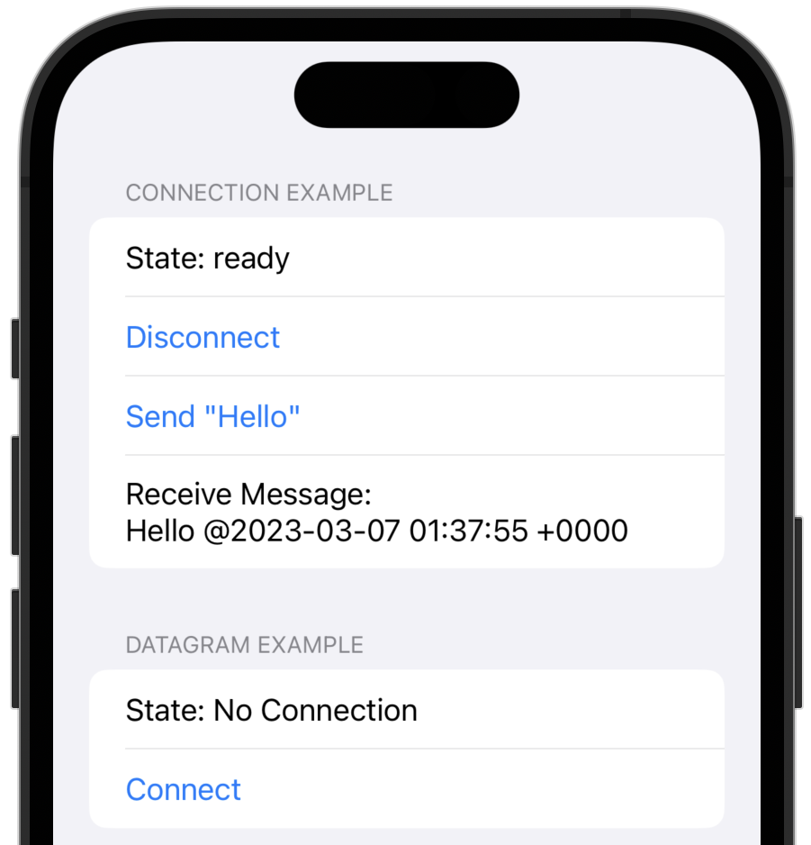

# swift-quic-examples
Example project for QUIC using Network.framework.



## iOS and macOS
### Requirements
* Xcode 14.3+

### Build
Open xcodeproj and build swift-quic-examples.

```
$ open swift-quic-examples.xcodeproj
```

## Server
### Requirements
* Go 1.19+

### Start Echo Server

```
$ make echo
```
